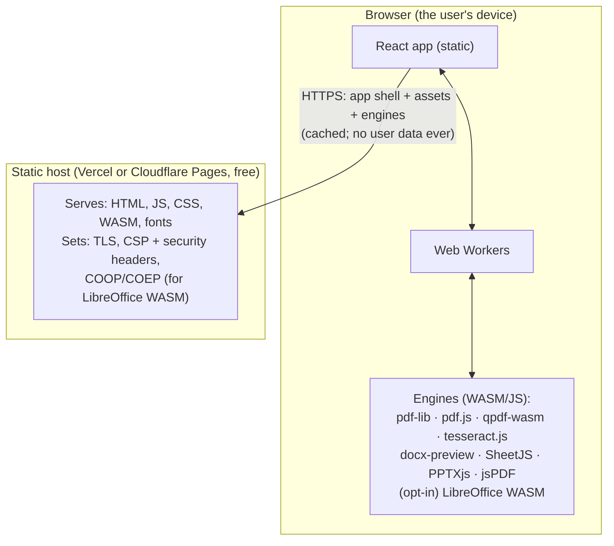

# 03 — Architecture

## Principles

1. **Client-side only.** The browser is the entire compute. The backend is a
   static file host and nothing else (ADR-011).
2. **Nothing to betray you.** There is no server that ever holds your data, so
   there is nothing to log, leak, subpoena, or misconfigure.
3. **Stateless everywhere.** No database, no disk writes of user content, no
   accounts. Nothing to back up or migrate.
4. **Small, auditable surface.** Few dependencies, all pinned; assets all
   same-origin; the whole app is static files a friend can inspect.

## System overview



Every document operation — Organize, Optimize, Edit, Unlock, Convert-to-PDF,
**including Word/PowerPoint/Excel → PDF** — happens in the browser. The host only
ever sends files *to* the browser; the browser never sends a document anywhere.
There is no `POST` endpoint that takes a file.

## Processing model

| Concern | Approach |
| --- | --- |
| Where | Web Worker (via `Comlink`), so the UI thread never blocks; heavy engines run off the main thread |
| Engines | `pdf-lib` (edit/build), `pdf.js` (render/preview/extract), `qpdf-wasm` (unlock), `tesseract.js` (OCR), `fflate` (zip), `utif` (TIFF), `docx-preview` / `SheetJS` / `PPTXjs` + `jsPDF` (Office→PDF default), `paged.js` + `html2canvas` (HTML→PDF), **LibreOffice WASM / ZetaJS** (Office→PDF high-fidelity, opt-in) |
| Loading | The app shell is small; every engine is code-split and lazy-loaded from our own origin on first use of a tool that needs it |
| Data lifetime | `ArrayBuffer` in worker memory for the duration of the task; released on completion / cancel / view unmount |
| Output | `Blob` → object URL for download, or File System Access API "Save to folder" on Chromium; object URL revoked immediately after |
| Network | none carrying document bytes — verifiable in DevTools for **every** tool |

### The one heavy engine: LibreOffice WASM (opt-in)

Office→PDF has a default tier (lightweight renderers, ~1–2 MB) and an opt-in tier
(LibreOffice compiled to WASM) — see [`02-feature-spec.md`](02-feature-spec.md) C2.

- Downloaded only when the user clicks "download the high-fidelity converter"
  (~100–250 MB), then served from the browser cache forever after.
- Needs **cross-origin isolation** (`Cross-Origin-Opener-Policy: same-origin` +
  `Cross-Origin-Embedder-Policy: require-corp`) for `SharedArrayBuffer`. Because
  every asset is same-origin, adding `Cross-Origin-Resource-Policy: same-origin`
  globally satisfies COEP with no other change. Decision on enabling this
  globally vs. on-demand: M3/M5 (open question Q4).
- Runs in a dedicated Worker; RAM-hungry. Feature-detected; the button is hidden
  on devices that can't run it, and the default tier still works there.

## Frontend structure

```text
app/
  routes/            # home (tool launcher), /t/:tool, /about, /settings
  tools/
    <tool>/
      spec.ts        # metadata: category, inputs, options schema, engine tier
      run.worker.ts  # the actual processing (imported by the worker pool)
      Options.tsx    # tool-specific option controls
  shell/             # ToolShell: dropzone, file list, options, run, result, chain
  workers/           # Comlink pool, transferable-based messaging
  lib/
    pdf/             # thin wrappers over pdf-lib / pdf.js / qpdf / tesseract
    office/          # docx-preview / SheetJS / PPTXjs adapters + LibreOffice-WASM adapter
  ui/                # design-system components (see 06-ui-ux.md)
  privacy/           # PrivacyBadge, "how to verify" content
```

- Each tool is a self-contained folder registered in a manifest. Adding a tool =
  add a folder + manifest entry. No tool imports another tool.
- The worker pool loads a tool's `run.worker.ts` on demand (code-split), so first
  paint doesn't ship qpdf / tesseract / LibreOffice-WASM / etc.
- State: `zustand` store scoped to the active tool session (files, page model,
  options, progress). Nothing in it is persisted.

## What is NOT in the architecture

- **No server, no serverless functions, no container, no `/api/*`.**
- No database, object storage, or queue.
- No auth service (open link — ADR-003; a static-host passphrase is the escalation).
- No SSR / Node runtime (pure static build).
- No CDN or third-party origin at runtime — every asset is same-origin.
- No analytics, telemetry, error reporting, background jobs, cron, or webhooks.

## Failure modes

| Failure | Behaviour |
| --- | --- |
| An engine module fails to load | Retry once; then an error with a reload hint. Other tools are unaffected (each loads its own engines). |
| File too big for browser memory | Detected pre-run; suggest Split first or a smaller export. iOS Safari is the tightest — warn earlier there. |
| Office file too complex for the default tier | Preview shows the degradation; offer the LibreOffice-WASM tier (or a plain "print to PDF from the source app" hint). |
| LibreOffice-WASM won't run (RAM / no cross-origin isolation) | Button hidden or disabled with a reason; default tier still available. |
| Corrupt PDF input | Offer Repair; never produce a silently broken output. |
| Host outage | Static host / CDN problem only; nothing to recover, no state. Cached visits still work if a service worker is added (post-launch). |
