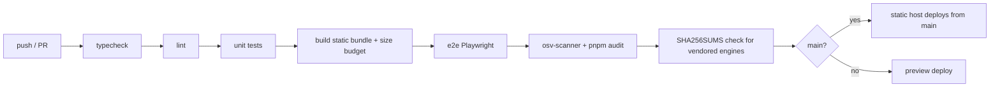

# 10 — Claude Code Skills & Dev Tooling

## About "downloading" skills

Claude Code skills aren't installed or downloaded into a project — they're
already available in the environment and are **invoked on demand** when a task
matches. This file is the plan for *which* skills we use and *when*, so nothing
gets forgotten.

## Skills this project will use

| Skill | When | Why it matters here |
| --- | --- | --- |
| **`design`** + **`artifact-design`** | Planning (now) and each UI iteration | Produce and refine the visual mockup / screen flows as a design canvas. `artifact-design` is the design-fundamentals pass loaded before any artifact. |
| **`artifact-diagramming`** | When adding/《updating》architecture or data-flow diagrams | Keeps diagrams legible in light/dark; used for the mermaid diagrams in `03`/`07` if they graduate to artifacts. |
| **`init`** | End of M0 (once code exists) | Generate the real `CLAUDE.md` "Commands" section from the actual scripts. |
| **`run`** | Every milestone, and M6 | Launch the real app, click through a change, capture screenshots — "does it actually work", not just tests. |
| **`code-review`** | End of **every** milestone (M1–M6), on the branch | Catch correctness bugs + reuse/simplification issues before merge. Start at `medium`, raise to `high` for M5/M6. |
| **`simplify`** | Mid-milestone when a module gets messy | Quality-only cleanup pass (no bug hunt). |
| **`security-review`** | Before **every** release, mandatory before launch (M6) | This is the load-bearing one. Reviews the pending diff for security issues — directly serves the threat model in `05`. |
| **`update-config`** | M0 (permissions) and M6 (guardrail hooks) | Set up settings.json: allowlist common dev commands; add hooks that block PRs adding analytics deps or third-party origins; run typecheck+lint on stop. |
| **`fewer-permission-prompts`** | After a few weeks of dev | Trim repetitive permission prompts from real transcripts. |
| **`claude-api`** | Only if we ever add a Claude-powered feature | Not planned — AI features are explicitly out of scope (`01`, ADR-009). Listed for completeness. |

Not expected: `dataviz` (no charts), `schedule` / `loop` (no recurring jobs),
`keybindings-help`.

## Guardrail hooks to configure (via `update-config`, M0–M6)

- **pre-commit / pre-PR:** fail if `package.json` gains a dependency matching a
  denylist (analytics/telemetry — `sentry`/`ga`/`posthog`/… — **or a server
  framework** — `express`/`fastify`/`next`/`koa`/…) without an ADR reference in
  the commit body.
- **pre-PR:** grep the production build (`dist/`) for external origins (`https://`
  hosts that aren't our own) → fail.
- **pre-PR:** assert the CSP string in `vercel.json` / `_headers` matches the one
  in `05` unless the diff touches an ADR.
- **on stop:** run `pnpm typecheck && pnpm lint` and report.
- **pre-commit:** verify `public/vendor/SHA256SUMS` matches the vendored engines.

## Dev tooling checklist (set up in M0)

- [ ] **pnpm** (strict, `--ignore-scripts` default, reviewed exceptions)
- [ ] **TypeScript** strict; `noUncheckedIndexedAccess`, `exactOptionalPropertyTypes`
- [ ] **ESLint** (`typescript-eslint` strict, `eslint-plugin-react-hooks`, an
      `import/no-restricted-paths` rule so tools can't import each other)
- [ ] **Prettier**
- [ ] **Vitest** + **@testing-library/react** + **@testing-library/user-event**
- [ ] **Playwright** (e2e; also the screenshot source for docs/About)
- [ ] **osv-scanner** + `pnpm audit --audit-level=high` in CI
- [ ] **Renovate** (grouped, manual merge)
- [ ] **Lighthouse CI** (perf + first-load budget; a11y score)
- [ ] **size-limit** or Vite bundle analyzer (every engine code-split, not in entry)
- [ ] **GitHub Actions**: typecheck → lint → unit → build → e2e → scan
- [ ] Local HTTPS for dev (mkcert) so CSP / COOP / COEP behave like production
- [ ] `.editorconfig`, `.nvmrc` / `engines`, `CONTRIBUTING.md` (friends can help)

## CI pipeline (shape)

The static host (Vercel / Cloudflare Pages) builds and deploys from `main`
automatically; PRs get preview URLs. No servers to push images to.
